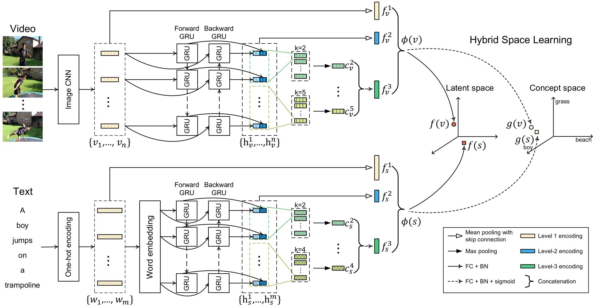

# Dual Encoding for Video Retrieval by Text

Source code of our TPAMI'21  paper [Dual Encoding for Video Retrieval by Text](https://arxiv.org/abs/2009.05381) and CVPR'19 paper [Dual Encoding for Zero-Example Video Retrieval](https://openaccess.thecvf.com/content_CVPR_2019/html/Dong_Dual_Encoding_for_Zero-Example_Video_Retrieval_CVPR_2019_paper.html).



## Requirements

#### Environments
* **Ubuntu** 16.04
* **CUDA** 10.1
* **Python** 3.8
* **PyTorch** 1.5.1

We used Anaconda to setup a deep learning workspace that supports PyTorch.
Run the following script to install the required packages.
```shell
conda create --name ws_dual_py3 python=3.8
conda activate ws_dual_py3
git clone https://github.com/danieljf24/hybrid_space.git
cd hybrid_space
pip install -r requirements.txt
conda deactivate
```

## Dual Encoding on MSRVTT10K
### Required Data
Run the following script to download and extract MSR-VTT ([msrvtt10k-resnext101_resnet152.tar.gz(4.3G)](http://8.210.46.84:8787/msrvtt10k-resnext101_resnet152.tar.gz)) dataset and a pre-trained word2vec ([vec500flickr30m.tar.gz(3.0G)](http://lixirong.net/data/w2vv-tmm2018/word2vec.tar.gz). The data can also be downloaded from Baidu pan ([url](https://pan.baidu.com/s/1lg23K93lVwgdYs5qnTuMFg), password:p3p0) or Google drive ([url](https://drive.google.com/drive/folders/1TEIjErztZNQAi6AyNu9cK5STwo74oI8I?usp=sharing)).
The extracted data is placed in `$HOME/VisualSearch/`.
```shell
ROOTPATH=$HOME/VisualSearch
mkdir -p $ROOTPATH && cd $ROOTPATH

# download and extract dataset
wget http://8.210.46.84:8787/msrvtt10k-resnext101_resnet152.tar.gz
tar zxf msrvtt10k-resnext101_resnet152.tar.gz -C $ROOTPATH

# download and extract pre-trained word2vec
wget http://lixirong.net/data/w2vv-tmm2018/word2vec.tar.gz
tar zxf word2vec.tar.gz -C $ROOTPATH
```

### Model Training and Evaluation
Run the following script to train and evaluate `Dual Encoding` network with hybrid space on the `official` partition of MSR-VTT. The video features are the concatenation of ResNeXt-101 and ResNet-152 features. The code of video feature extraction we used in the paper is available at [here](https://github.com/xuchaoxi/video-cnn-feat). 
```shell
conda activate ws_dual_py3
./do_all.sh msrvtt10k hybrid resnext101-resnet152
```
Running the script will do the following things:
1. Train `Dual Encoding` network with hybrid space and select a checkpoint that performs best on the validation set as the final model. Notice that we only save the best-performing checkpoint on the validation set to save disk space.
2. Evaluate the final model on the test set.
Note that the dataset has already included vocabulary and concept annotations. If you would like to generate vocabulary and concepts by yourself, run the script `./do_vocab_concept.sh msrvtt10k 1`.


If you would like to train `Dual Encoding` network with the latent space learning (Conference Version), please run the following scrip:
```shell
./do_all.sh msrvtt10k latent resnext101-resnet152
```

To train the model on the `Test1k-Miech` partition and `Test1k-Yu` partition of MSR-VTT, please run the following scrip:
```shell
./do_all.sh msrvtt10kmiech hybrid resnext101-resnet152
./do_all.sh msrvtt10kyu hybrid resnext101-resnet152
```

### Evaluation using Provided Checkpoints

The overview of pre-trained checkpoints on MSR-VTT is as follows. 
| Split         | Pre-trained Checkpoints |
| ----------    | ------------ |
| Official      | [msrvtt10k_model_best.pth.tar(264M)](http://8.210.46.84:8787/checkpoints/msrvtt10k_model_best.pth.tar) |
| Test1k-Miech  | [msrvtt10kmiech_model_best.pth.tar(267M)](http://8.210.46.84:8787/checkpoints/msrvtt10kmiech_model_best.pth.tar) |
| Test1k-Yu     | [msrvtt10kyu_model_best.pth.tar(267M)](http://8.210.46.84:8787/checkpoints/msrvtt10kyu_model_best.pth.tar) |

Note that if you would like to evaluate using our trained checkpoints, please make sure to use the vocabulary and concept annotations that are provided in the `msrvtt10k-resnext101_resnet152.tar.gz`.


#### On the official split
Run the following script to download and evaluate our trained checkpoints on the official split of MSR-VTT. The trained checkpoints can also be downloaded from Baidu pan ([url](https://pan.baidu.com/s/1lg23K93lVwgdYs5qnTuMFg), password:p3p0). 

```shell
MODELDIR=$HOME/VisualSearch/checkpoints
mkdir -p $MODELDIR

# download trained checkpoints
wegt -P $MODELDIR http://8.210.46.84:8787/checkpoints/msrvtt10k_model_best.pth.tar

# evaluate on the official split of MSR-VTT
CUDA_VISIBLE_DEVICES=0 python tester.py --testCollection msrvtt10k --logger_name $MODELDIR  --checkpoint_name msrvtt10k_model_best.pth.tar
```

#### On Test1k-Miech and Test1k-Yu splits
In order to evaluate on `Test1k-Miech` and  `Test1k-Yu` splits, please run the following script.

```shell
MODELDIR=$HOME/VisualSearch/checkpoints

# download trained checkpoints on Test1k-Miech
wegt -P $MODELDIR http://8.210.46.84:8787/checkpoints/msrvtt10kmiech_model_best.pth.tar

# evaluate on Test1k-Miech of MSR-VTT
CUDA_VISIBLE_DEVICES=0 python tester.py --testCollection msrvtt10kmiech --logger_name $MODELDIR  --checkpoint_name msrvtt10kmiech_model_best.pth.tar
```

```shell
MODELDIR=$HOME/VisualSearch/checkpoints

# download trained checkpoints on Test1k-Yu
wegt -P $MODELDIR http://8.210.46.84:8787/checkpoints/msrvtt10kyu_model_best.pth.tar

# evaluate on Test1k-Yu of MSR-VTT
CUDA_VISIBLE_DEVICES=0 python tester.py --testCollection msrvtt10kyu --logger_name $MODELDIR  --checkpoint_name msrvtt10kyu_model_best.pth.tar
```
#### Expected Performance
The expected performance of Dual Encoding on MSR-VTT is as follows. Notice that due to random factors in SGD based training, the numbers differ slightly from those reported in the paper.
<table>
    <tr>
        <th rowspan='2'>Split</th><th colspan='5'>Text-to-Video Retrieval</th> <th colspan='5'>Video-to-Text Retrieval</th>  <th rowspan='2'>SumR</th>
    </tr>
    <tr>
        <th> R@1 </th> <th> R@5 </th> <th> R@10 </th> <th> MedR </th> <th>	mAP </th> <th> R@1 </th> <th> R@5 </th> <th> R@10 </th> <th> MedR </th> <th>	mAP </th>
    </tr>
    <tr>  
    	<td>Official</td>
		<td>11.8</td><td>30.6</td><td>41.8</td><td>17</td><td>21.4</td> 
    	<td>21.6</td><td>45.9</td><td>58.5</td><td>7</td><td>10.3</td> 
    	<td>210.2</td> 
    </tr>
	<tr>  
		<td>Test1k-Miech</td>
		<td>22.7</td><td>50.2</td><td>63.1</td><td>5</td><td>35.6</td> 
    	<td>24.7</td><td>52.3</td><td>64.2</td><td>5</td><td>37.2</td> 
    	<td>277.2</td> 
    </tr>
	<tr>  
		<td>Test1k-Yu</td>
		<td>21.5</td><td>48.8</td><td>60.2</td><td>6</td><td>34.0</td> 
    	<td>21.7</td><td>49.0</td><td>61.4</td><td>6</td><td>34.6</td> 
    	<td>262.6</td>      
	</tr>
</table>


## Dual Encoding on VATEX

### Required Data
Download VATEX dataset ([vatex-i3d.tar.gz(3.0G)](http://8.210.46.84:8787/vatex-i3d.tar.gz)) and a pre-trained word2vec ([vec500flickr30m.tar.gz(3.0G)](http://lixirong.net/data/w2vv-tmm2018/word2vec.tar.gz)). The data can also be downloaded from Baidu pan ([url](https://pan.baidu.com/s/1lg23K93lVwgdYs5qnTuMFg), password:p3p0) or Google drive ([url](https://drive.google.com/drive/folders/1TEIjErztZNQAi6AyNu9cK5STwo74oI8I?usp=sharing)).
Please extract data into `$HOME/VisualSearch/`.

### Model Training and Evaluation
Run the following script to train and evaluate `Dual Encoding` network with hybrid space on VATEX.
```shell
# download and extract dataset
wget http://8.210.46.84:8787/vatex-i3d.tar.gz
tar zxf vatex-i3d.tar.gz -C $ROOTPATH

./do_all.sh vatex hybrid
```

### Expected Performance
Run the following script to download and evaluate our trained model ([vatex_model_best.pth.tar(230M)](http://8.210.46.84:8787/checkpoints/vatex_model_best.pth.tar)) on VATEX.
```shell
MODELDIR=$HOME/VisualSearch/checkpoints

# download trained checkpoints
wegt -P $MODELDIR http://8.210.46.84:8787/checkpoints/vatex_model_best.pth.tar

CUDA_VISIBLE_DEVICES=0 python tester.py --testCollection vatex --logger_name $MODELDIR  --checkpoint_name vatex_model_best.pth.tar
```

The expected performance of Dual Encoding with hybrid space learning on MSR-VTT is as follows. 
<table>
    <tr>
        <th rowspan='2'>Split</th><th colspan='5'>Text-to-Video Retrieval</th> <th colspan='5'>Video-to-Text Retrieval</th>  <th rowspan='2'>SumR</th>
    </tr>
    <tr>
        <th> R@1 </th> <th> R@5 </th> <th> R@10 </th> <th> MedR </th> <th>	mAP </th> <th> R@1 </th> <th> R@5 </th> <th> R@10 </th> <th> MedR </th> <th>	mAP </th>
    </tr>
    <tr>  
    	<td>VATEX</td>
		<td>35.8</td><td>72.8</td><td>82.9</td><td>2</td><td>52.0</td> 
    	<td>47.5</td><td>76.0</td><td>85.3</td><td>2</td><td>39.1</td> 
    	<td>400.3</td>      
    </tr>
</table>


## Dual Encoding on Ad-hoc Video Search (AVS) (still working)

### Data

The following three datasets are used for training, validation and testing: tgif-msrvtt10k, tv2016train and iacc.3. For more information about these datasets, please refer to https://github.com/li-xirong/avs.

Run the following scripts to download and extract these datasets. The extracted data is placed in `$HOME/VisualSearch/`.

#### Sentence data
* Sentences: [tgif-msrvtt10k](http://lixirong.net/data/mm2019/tgif-msrvtt10k-sent.tar.gz), [tv2016train](http://lixirong.net/data/mm2019/tv2016train-sent.tar.gz)
* TRECVID 2016 / 2017 / 2018 AVS topics and ground truth:  [iacc.3](http://lixirong.net/data/mm2019/iacc.3-avs-topics.tar.gz)

#### Frame-level feature data
* 2048-dim ResNeXt-101: [tgif](http://39.104.114.128/avs/tgif_ResNext-101.tar.gz)(7G), [msrvtt10k](http://39.104.114.128/avs/msrvtt10k_ResNext-101.tar.gz)(2G), [tv2016train](http://39.104.114.128/avs/tv2016train_ResNext-101.tar.gz)(42M), [iacc.3](http://39.104.114.128/avs/iacc.3_ResNext-101.tar.gz)(27G)

```shell
ROOTPATH=$HOME/VisualSearch
cd $ROOTPATH

# download and extract dataset
wget http://39.104.114.128/avs/tgif_ResNext-101.tar.gz
tar zxf tgif_ResNext-101.tar.gz

wget http://39.104.114.128/avs/msrvtt10k_ResNext-101.tar.gz
tar zvf msrvtt10k_ResNext-101.tar

wget http://39.104.114.128/avs/tv2016train_ResNext-101.tar.gz
tar zvf tv2016train_ResNext-101.tar.gz

wget http://39.104.114.128/avs/iacc.3_ResNext-101.tar.gz
tar zvf iacc.3_ResNext-101.tar.gz

# combine feature of tgif and msrvtt10k
./do_combine_features.sh

```

### Train Dual Encoding model from scratch

```shell
source ~/ws_dual/bin/activate

trainCollection=tgif-msrvtt10k
visual_feature=pyresnext-101_rbps13k,flatten0_output,os

# Generate a vocabulary on the training set
./do_get_vocab.sh $trainCollection

# Generate video frame info
#./do_get_frameInfo.sh $trainCollection $visual_feature


# training and testing
./do_all_avs.sh 

deactive
```

## How to run Dual Encoding on another datasets? (still working)

Store the training, validation and test subset into three folders in the following structure respectively.
```shell
${subset_name}
├── FeatureData
│   └── ${feature_name}
│       ├── feature.bin
│       ├── shape.txt
│       └── id.txt
└── TextData
    └── ${subset_name}train.caption.txt
    └── ${subset_name}val.caption.txt
    └── ${subset_name}test.caption.txt
```

* `FeatureData`: video frame features. Using [txt2bin.py](https://github.com/danieljf24/simpleknn/blob/master/txt2bin.py) to convert video frame feature in the required binary format.
* `${dsubset_name}.caption.txt`: caption data. The file structure is as follows, in which the video and sent in the same line are relevant.
```
video_id_1#1 sentence_1
video_id_1#2 sentence_2
...
video_id_n#1 sentence_k
...
```

You can run the following script to check whether the data is ready:
```shell
./do_format_check.sh ${train_set} ${val_set} ${test_set} ${rootpath} ${feature_name}
```
where `train_set`, `val_set` and `test_set` indicate the name of training, validation and test set, respectively, ${rootpath} denotes the path where datasets are saved and `feature_name` is the video frame feature name.


If you pass the format check, use the following script to train and evaluate Dual Encoding on your own dataset:
```shell
source ~/ws_dual/bin/activate
./do_all_own_data.sh ${train_set} ${val_set} ${test_set} ${rootpath} ${feature_name} ${caption_num} full
deactive
```

If training data of your task is relatively limited, we suggest dual encoding with level 2 and 3. Compared to the full edition, this version gives nearly comparable performance on MSR-VTT, but with less trainable parameters.
```shell
source ~/ws_dual/bin/activate
./do_all_own_data.sh ${train_set} ${val_set} ${test_set} ${rootpath} ${feature_name} ${caption_num} reduced
deactive
```


## References
If you find the package useful, please consider citing our TPAMI'21 or CVPR'19 paper:
```
@article{dong2021dual,
  title={Dual Encoding for Video Retrieval by Text},
  author={Dong, Jianfeng and Li, Xirong and Xu, Chaoxi and Yang, Xun and Yang, Gang and Wang, Xun and Wang, Meng},
  journal={IEEE Transactions on Pattern Analysis and Machine Intelligence},
  doi = {10.1109/TPAMI.2021.3059295},
  year={2021}
}
```


```
@inproceedings{cvpr2019-dual-dong,
title = {Dual Encoding for Zero-Example Video Retrieval},
author = {Jianfeng Dong and Xirong Li and Chaoxi Xu and Shouling Ji and Yuan He and Gang Yang and Xun Wang},
booktitle = {IEEE Conference on Computer Vision and Pattern Recognition (CVPR)},
year = {2019},
}
```